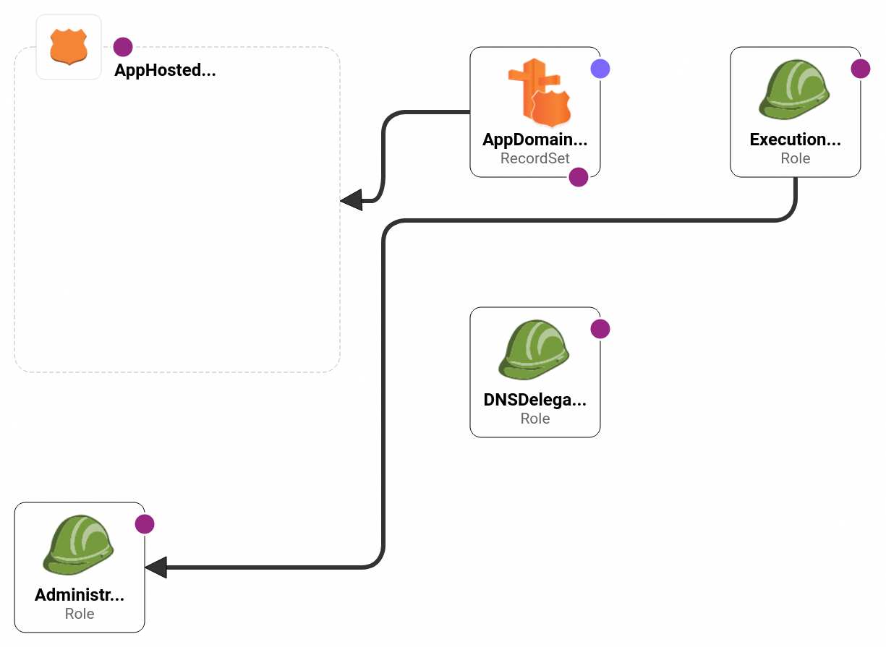
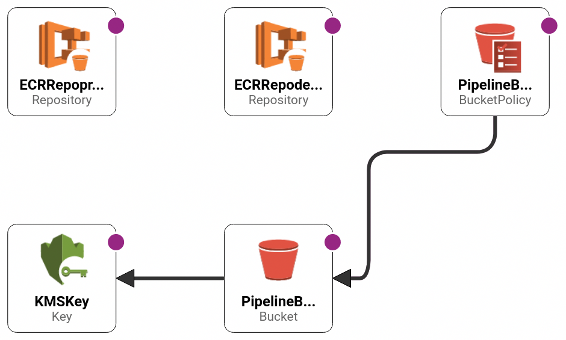
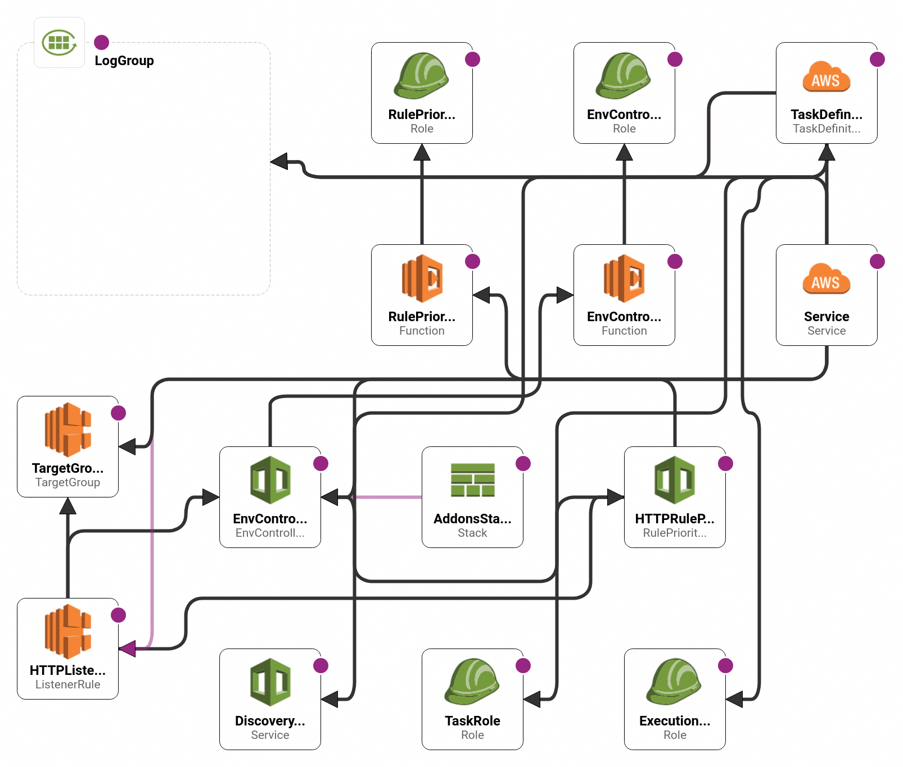
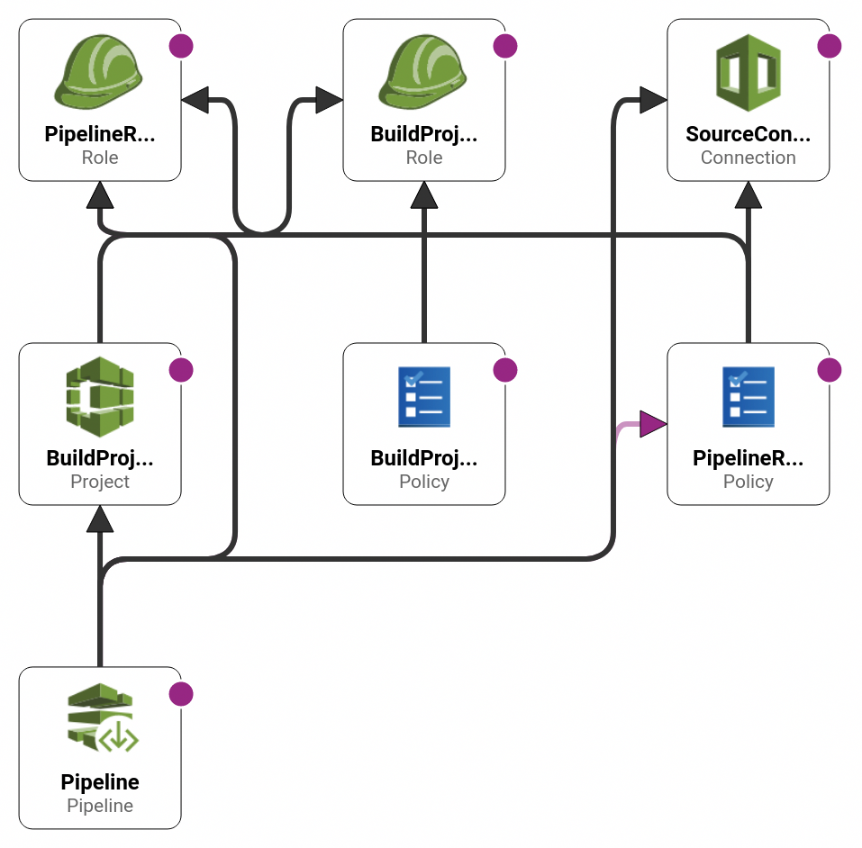

# INDEX
- [ABOUT](#ABOUT)
- [ENVIRONMENT](#ENVIRONMENT)
- [PREPARING](#PREPARING)
- [HOW TO USE](#HOW-TO-USE)
- [MEMO](#MEMO)
******


# ENVIRONMENT
- AWS: ECS on FargateにCode Pipeline経由でデプロイする。サンプルではdevとprod環境を用意し、dev環境で動作確認後に承認ボタンを押すとprod環境にもデプロイが進む形になっている。
- Github Actions
- アプリ: React sample
******


# ABOUT
Sample for DevSecOps environment.
## AWS
- app-infrastructure-roles

- app-infrastructure

- environment

- service

- pipeline

******


## Automation Tools
See [./doc/tools_doc](./doc/tools_doc)
### local
- pre-commit，git-secret
### GitHub Actions
- semgrep
- jest
- trivy(dependency check)

### AWS CodePipeline
- trivy(image scan)
******


# PREPARING
## AWSの設定
copilot cliを使って環境構築を行う。
### appの作成
- 名前は任意だが，自分はreact-appとした
- ここで必用なIAMロールの一部やKMSのキーやCodePipelineに使うS3やそのポリシーが作成されている。

```shell
copilot app init
cat ./copilot/.workspace
application: react-app
```
### development用のenvironmentとserviceをまとめて作成する。
- amd64を指定しないとなぜかビルドエラーになる。
- 名前は任意だが，dev-envとdev-svcとした。
- TypeはLoad Balancerを選択した。

```shell
DOCKER_DEFAULT_PLATFORM=linux/amd64 copilot init
```
- copilot/以下のファイルを編集することで設定を変更できる。
- 新しいVPCや，ECSのCluster，Load Balancerや権限周りが作成される。

### production用のenvironmentとserviceをまとめて作成する。
- vpcをいくつも作りたくない場合はenvironment単体で作成すると既存リソースの使用が選択できる(VPC含めて完全新規にしたいなら上の手順を繰り返す)。

```shell
copilot env init # prod-envと命名してcopilot-react-app-dev-vpcを選択する。
```
<details>
<summary>see detail</summary>

```shell
copilot env init
Environment name: prod-env

  Which credentials would you like to use to create hoge?  [Use arrows to move, type to filter, ? for more help]
    Enter temporary credentials
  > [profile default]


Environment name: prod-env
Credential source: [profile default]
Would you like to use the default configuration for a new environment?
    - A new VPC with 2 AZs, 2 public subnets and 2 private subnets
    - A new ECS Cluster
    - New IAM Roles to manage services and jobs in your environment
  [Use arrows to move, type to filter]
    Yes, use default.
    Yes, but I'd like configure the default resources (CIDR ranges, AZs).
  > No, I'd like to import existing resources (VPC, subnets).


Environment name: prod-env
Credential source: [profile default]
Default environment configuration? No, I'd like to import existing resources

  Which VPC would you like to use?  [Use arrows to move, type to filter]
  > vpc-xxxxxxxxxxxxxxxxx (copilot-react-app-dev-env)
```
</details>
- environmentをデプロイ

```shell
copilot env deploy
```

- prod用のserviceを作成してデプロイする。
この際に間違えてdev-svcやdev-envを選ばないように注意する。

```shell
DOCKER_DEFAULT_PLATFORM=linux/amd64 copilot svc init
copilot svc deploy
```
- ブラウザからアクセスできるか試してみる。

```shell
copilot svc show # urlが出てくるので
```


### CodePipelineの作成
- 名前は任意だが，自分はreact-app-pipelineとした。

```shell
copilot pipeline init
```
- [manifest.yml](./copilot/pipelines/react-app-pipeline/manifest.yml)を編集してdevelopmentでサービス開始後にユーザが承認した後にproductionにデプロイされるようにする。

```
    requires_approval: true
```
- 先にgithubに設定ファイルをアップロードしてからpipelineをデプロイする

```shell
git add .
git commit -m "add pipeline"
git push
copilot pipeline deploy
```
- ACTION REQUIREDが出るのでURLにアクセスし，pendingになっているpipelineとGitHubを接続する設定を追加する。
- 一度pipelineをデプロイすると以後，指定したGitHubのブランチにマージされるたびにCode Pipelineを通してデプロイが進むようになる。
#### CodePipelineにimage scanを追加する
- [./copilot/pipelines/react-app-pipeline/buildspec.yml](./copilot/pipelines/react-app-pipeline/buildspec.yml)を編集してtrivyによるimage scanを追加する。
> [ECRのイメージスキャン機能](https://docs.aws.amazon.com/ja_jp/AmazonECR/latest/userguide/image-scanning.html)はデフォルトであるので併用してもよいかも。

```
install:
  commands:
      - echo "install trivy"
      - rpm -ivh https://github.com/aquasecurity/trivy/releases/download/v0.48.0/trivy_0.48.0_Linux-64bit.rpm
```

```
      # Run trivy scan on the docker images.
      - trivy image --vuln-type os --no-progress --format table -o container-scanning-report.txt --severity CRITICAL,HIGH $(jq -r '.Parameters.ContainerImage' ./infrastructure/dev-svc-dev-env.params.json)
      - cat container-scanning-report.txt
```

<details>
<summary>buildspec.ymlの解説</summary><div>
- ./infrastructureをビルドによって作成しており，この中にECRのイメージが書いてあるのでこれをjqコマンドで抜き出している。
- trivyに関する詳細は[./doc/tools_doc/trivy.md]を確認。

```
cat ./infrastructure/dev-svc-dev-env.params.json
{
  "Parameters": {
    "AddonsTemplateURL": "",
    "AppName": "react-app",
    "ContainerImage": "xxxxxx.dkr.ecr.ap-northeast-1.amazonaws.com/react-app/dev-svc:xxxxxx-xxxxx-xxxx-xxxx-xxxxxxxxxxxx-dev-env",
  }
}
jq -r '.Parameters.ContainerImage' ./infrastructure/dev-svc-dev-env.params.json
xxxxxx.dkr.ecr.ap-northeast-1.amazonaws.com/react-app/dev-svc:xxxxxx-xxxxx-xxxx-xxxx-xxxxxxxxxxxx-dev-env
```

</div></details>

******


## その他の設定
- ローカルでのセットアップが必用なのはgit-secretsとpre-commitくらい
- [pre-commitのドキュメント](./doc/tools_doc/pre-commit.md)
- [git-secretsのドキュメント](./doc/tools_doc/git-secret.md)

```shell
cd devsecops-demo-aws-ecs
pre-commit install

git secrets --install
git secrets --register-aws # awsのクレデンシャル検知ルールを登録
```
- VSCodeのExtensionsもお好みで。Dockerのhadolintはおすすめ。

- GitHub Actionsがスキャン結果のファイルをアップロードできるように権限をつける。詳細は[semgrepのyaml](./.github/workflows/react-semgrep.yaml)を参照。
******


# HOW TO USE
1. [PREPARING](#PREPARING)の設定を先にやる。
2. commit時にはpre-commitとgit-secretが作動
3. push時にはGitHub ActionsによりSAST(semgrep)，UnitTest(jest)，Dependency Check(trivy)が実行される。
4. masterブランチにマージしたりmasterにpushした時にCodePipelineによってAWSへリポジトリがクローンされ，ビルド(image scanを含む)，developmentへのデプロイが始まる。
5. developmentで問題がなければCodePipeline上で承認し，productionへデプロイ
******


# MEMO
## Code Buildのエラー
以下コマンドでログが見れる。

```shell
copilot svc logs --previous
```

### nginx: [emerg] bind() to 0.0.0.0:80 failed (13: Permission denied)
- [ECSの仕様で非特権ユーザを使用したコンテナでは80番ポートが使えないっぽい](https://repost.aws/questions/QU1bCV9wT4T5iBrrP1c2ISfg/container-cannot-bind-to-port-80-running-as-non-root-user-on-ecs-fargate) --> つまり，localのdockerで80でサービスが起動できてもECSだと権限エラーになる。このため，コンテナで開放するportは8080としている(ALBに対して8080がマッピングされているためブラウザからは80でアクセスできる)。
### toomanyrequests: You have reached your pull rate limit. You may increase the limit by authenticating and upgrading: https://www.docker.com/increase-rate-limit
- Docker Hubに短期間にアクセスしすぎているだけなので放置でOK
### Error response from daemon: dockerfile parse error
- DockerfileのRUNをヒアドキュメントで書いていたら怒られた(ローカルでは動いてたのに...)

```
# 修正前Dockerfile
RUN <<EOF
mkdir -p /var/log/nginx
chown -R nginx:nginx /var/log/nginx
touch /run/nginx.pid
chown -R nginx:nginx /run/nginx.pid
EOF

# 修正後
RUN mkdir -p /var/log/nginx \
    && chown -R nginx:nginx /var/log/nginx \
    && touch /run/nginx.pid \
    && chown -R nginx:nginx /run/nginx.pid
```

### Resource handler returned message: "Error occurred during operation 'ECS Deployment Circuit Breaker was triggered'.
コンテナが正常に起動していない。amd64を指定したら動いた。

```shell
DOCKER_DEFAULT_PLATFORM=linux/amd64 copilot deploy
```
******


## その他
### copilot app showでCFnスタックを消したはずのアプリが表示されてしまう
- copilot app showはParameter Storeを見ているのでそこを消す。
