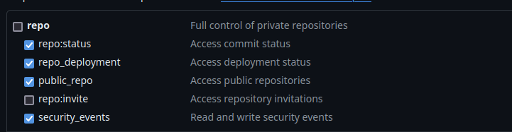
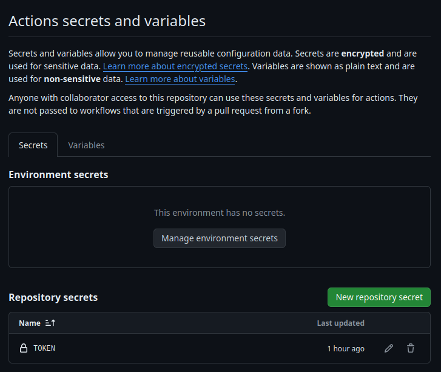
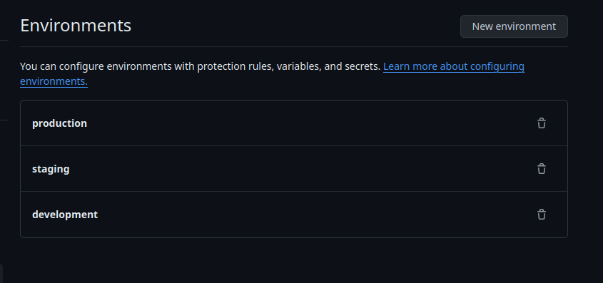

# DevSecOps demo React application for AWS ECS on Fargate


[](https://github.com/RyosukeDTomita/devsecops-demo-aws-ecs/actions/workflows/react-jest.yaml)
[](https://github.com/RyosukeDTomita/devsecops-demo-aws-ecs/actions/workflows/react-semgrep.yaml)
[](https://github.com/RyosukeDTomita/devsecops-demo-aws-ecs/actions/workflows/react-dependency-check.yaml)
[](https://github.com/RyosukeDTomita/devsecops-demo-aws-ecs/actions/workflows/actions-linter.yaml)

## INDEX

- [ABOUT](#about)
- [ENVIRONMENT](#environment)
- [PREPARING](#preparing)
- [HOW TO USE](#how-to-use)
- [ERROR LOG](#error-log)

---

## ABOUT

Sample React application for Trying to Use DevSecOps tools.

> [!WARNING]
> Since it costs money to maintain the AWS environment created with copilot-cli for the demo environment, I plan to use `GitHub-Pages` for future demos. I have archived [this branch](https://github.com/RyosukeDTomita/devsecops-demo-aws-ecs).
> デモ環境に対して`copilot-cli`で作ったAWS環境を維持するのにお金がかかるのはもったいないので，以降は`github-pages`を使ってデモを動かそうと思います。[このブランチ](https://github.com/RyosukeDTomita/devsecops-demo-aws-ecs)をアーカイブとして残してあります。

1. [PREPARING](#preparing)の設定を先にやる。
2. commit時にはpre-commitとgit-secretが作動。
3. push時にはGitHub ActionsによりSAST(semgrep)，UnitTest(jest)，Dependency Check(trivy)が実行される。
4. github-pagesにデプロイされる。 # TODO: more info

## ENVIRONMENT

### デプロイするアプリ

`create-react-app`で作られるデフォルトそのまま。

### GitHub Actions等(git push後)に使うツール

- [ghalint](./doc/tools_doc/ghalint.md): GitHub Actionsで実行されるworkflows用のlinter
- [github-comment](./doc/tools_doc/github-comment.md): GitHub Actionsで実行されるCIが失敗したときにコメントとしてエラーを出力する。
- [semgrep](./doc/tools_doc/semgrep.md): GitHub Actionsで実行するSASTツール
- [trivy](./doc/tools_doc/trivy.md): イメージのスキャンやdependency checkができる。dependency checkはGitHub Actionsで実行，イメージスキャンは#TODO

- [aqua](./doc/tools_doc/aqua.md): GitHub Actionsで使用するCLIツールのバージョン管理ができる。
- [pinact](./doc/tools_doc/pinact.md): GitHub Actionsで使うactionsのバージョンをフルコミットハッシュに変換。

> [!NOTE]
> 一応単体テスト枠でjestもGitHub Actionsで実行される。

### pre-commit(git committ前)に使うツール

- [pre-commit](./doc/tools_doc/pre-commit.md): git commit前に特定のツールを実行し，失敗ならcommitさせない。
  - [hadolint](./doc/tools_doc/hadolint.md)
  - ESLint
  - Prettier(Formatter)
  - [Markdown linter](./doc/tools_doc/markdown_tools.md)
- [git-secret](./doc/tools_doc/pre-commit.md): git commit時にクレデンシャルのパターンにマッチするものがあれば，commitさせない。
- VSCode Extensions(Securityに関係のありそうなものだけ抜粋)
  - [hadolint](https://marketplace.visualstudio.com/items?itemName=exiasr.hadolint): Dockerfileのlinter
  - [markdownlint](https://marketplace.visualstudio.com/items?itemName=DavidAnson.vscode-markdownlint)
  - [zenkaku](https://marketplace.visualstudio.com/items?itemName=mosapride.zenkaku): 半角スペースを可視化
  - [Code spell checker](https://marketplace.visualstudio.com/items?itemName=streetsidesoftware.code-spell-checker)
  - ESLint
  - Prettier

---

## PREPARING

### 始めにやること

- Reopsitoryをforkする。

### ローカルにインストールするツール

- `pre-commit`
- `git secret`
- `gh`コマンドのインストール
- VSCodeのExtensionsもお好みでインストール。TODO: Devcontainer化する。

### GitHub Actionsでghコマンドを使うための設定

- [Personal access tokens](https://github.com/settings/tokens)を作り，repository secretsに登録する。
TODO: 一旦これくらいで作成。もっと権限しぼれるかも

- repository secretsに登録する。


### GitHub Pagesの設定

[./doc/github-pages.md](./doc/github-pages.md)

### GitHub Actions Variablesの設定

- Repositoryに[Environment](https://github.com/RyosukeDTomita/devsecops-demo-aws-ecs/settings/environments)を作る。

- ローカルに3環境分の.envファイルをを作成する。

```shell
# 作成
for environment in development staging production;
do
  touch .env.${environment}
  echo $REACT_APP_MESSAGE=${environment} > .env.${environment}
done
```

- github actions enrironment variablesに登録/更新する。

```shell
source ./update_github_actions_variables.sh
```

### GitHub Actionsで実行したスキャン結果をアップロードできるようにGitHubリポジトリの設定を変更する

- GitHub Actionsがスキャン結果のファイルをアップロードできるようにGitHubリポジトリの設定を変更。詳細は[semgrepのyaml](./.github/workflows/react-semgrep.yaml)を参照。

---

## HOW TO USE

### コミット時の検査セットアップ

- git-secretsのセットアップ。

```shell
cd devsecops-demo-aws-ecs
pre-commit install

git secrets --install
git secrets --register-aws # awsのクレデンシャル検知ルールを登録
```

- pre-commitのセットアップ

```shell
pip install pre-commit
pre-commit install
```

---

## ERROR LOG

<details>
<summary>今まで詰まったエラー一覧</summary>
<div>
TODO
</div>
</details>
