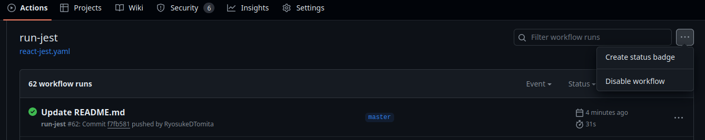

# GitHub Actions 関連

> [!NOTE]
> 個々のツールの GitHub Actions の実行方法はツールごとのドキュメント参照。

## README にバッチをつける

### GitHub Actions の Workflow

- リポジトリの Actions のページから**Create status badge**をクリックして README.md に貼り付ける。



### license を示すバッチをつける

- `https://img.shields.io/github/license/<Github-Username>/<Repository>`のようにしてつける。
  

---

## 特定のコミットを使って actions を実行する

```yaml
actions/setup-python@コミットハッシュ
```
