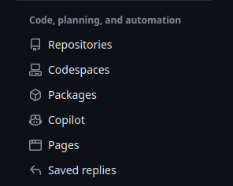
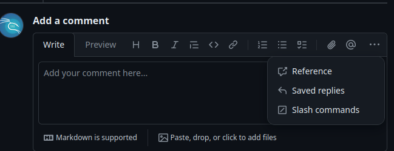

# 返信テンプレートを使う

## 返信テンプレートとは

- レビューコメントを残す際にテンプレートが作れる。

---

## 返信テンプレートの登録方法

> [github公式ドキュメントの返信テンプレートの作成](https://docs.github.com/ja/get-started/writing-on-github/working-with-saved-replies/creating-a-saved-reply)

タイトルと内容を登録する。

> [!NOTE]
> [参考にしたテンプレート内容](https://qiita.com/ucan-lab/items/eeef46cee4b928106d1d)
> [Shields.io](https://shields.io/)とか登録すると良さそう。

---

## 返信テンプレートを使う

MenuからTemplateを選ぶ。

